# 바이브코딩으로 배포까지 — 3회차 강의자료

> 참고 영상: https://youtu.be/P3jFI-VpyLg (13:11 ~ 37:03)
> 원본 PDF: [1주차]AI Product Builder (p70~p112)

---

## 슬라이드 1 — 웹 개발 기초 (p70)

### 스크립트

이제 웹 개발 바로 진행해 보도록 하겠습니다.

---

## 슬라이드 2 — 웹 개발이란? (p71)

### 스크립트

일단 웹 개발이란, 크롬 브라우저는 한 번씩 좀 써보셨죠? 브라우저를 통해서 접근해서 이용할 수 있는 이런 서비스, 이거를 이제 웹 서비스라고 하고요. 이걸 개발하는 과정이 웹 개발입니다.

그래서 이걸 왜 하냐? 제가 봤을 때 가장 난이도도 낮으면서 이해하기도 좋고, 인터넷에 한 번쯤 어떤 사이트 들어가 본 건 해보셨을 거잖아요. 그래서 익숙하면서 내가 만든 어떤 것도 구글이나 똑같이 전 세계 누구나 쓸 수 있게 만드는 게 어렵지가 않습니다.

---

## 슬라이드 3 — 프론트엔드와 백엔드 (p72)

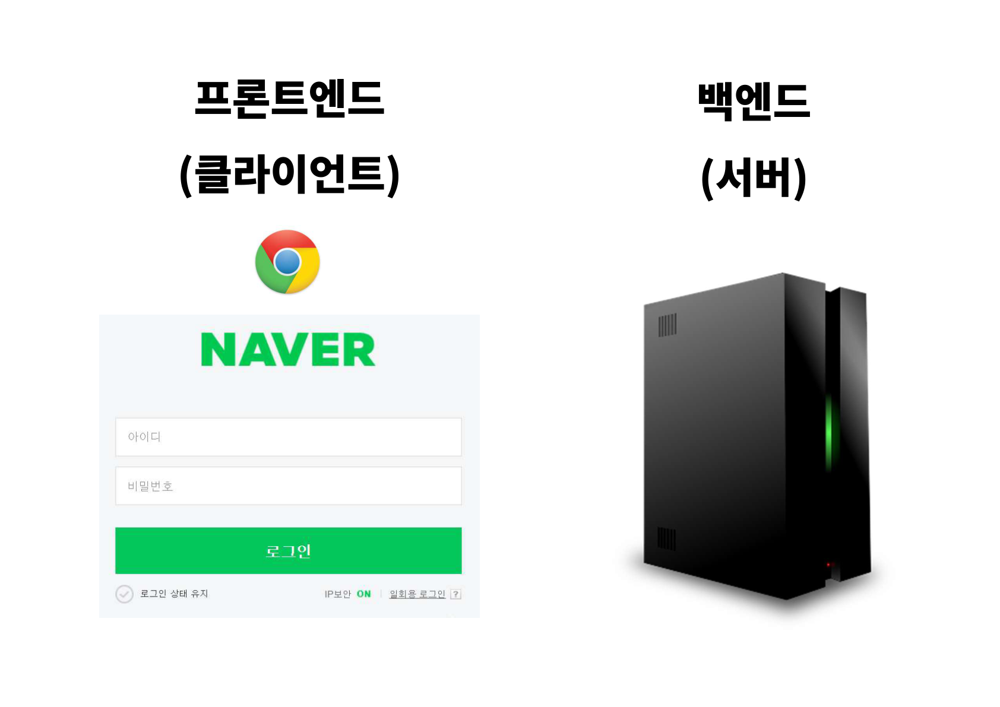

### 스크립트

그래서 아까 소개 드렸듯이 웹 사이트도 마찬가지로 프론트엔드 클라이언트 부분과 백엔드 서버 부분이 있습니다. 서버 쪽은 약간은 좀 난이도가 있을 수 있어요. 이 프론트엔드 화면 만드는 건 그나마 좀 직관적으로 이해하기 좋거든요. 그래서 이렇게 왔다 갔다 할 거지만, 프론트엔드를 먼저 배운다라고 이해해 주시면 좋을 것 같습니다.

---

## 슬라이드 4 — HTML, CSS, JavaScript (p73)

### 스크립트

그래서 이 프론트엔드, 웹의 프론트엔드는 진짜 별거 없습니다. 이 세 가지 언어를 아시면 끝납니다. HTML, CSS, JavaScript. 이 세 개의 언어로 이 웹 개발이 구성이 되어 있습니다.

아니, 웹 개발 쉽다면서 무슨 언어를 세 개나 써가지고 개발하냐라고 생각이 들 수 있는데, 사실 크게 어렵지 않습니다. 심지어 문법은 이제 몰라도 됩니다. 역할만 알면 됩니다. 아, HTML이 이런 걸 하는 거고, CSS가 이런 걸 하는 거고, 자바스크립트가 이런 걸 하는 거다 정도만 알면 AI한테 "HTML 코드 만들어줘" 하면 만들어주고, "CSS 코드 만들어줘" 하면 만들어주고, 그 개념만 알면 되지 세부적인 문법은 이제 AI 시대에 알 필요가 없다라고 소개를 드립니다.

---

## 슬라이드 5 — HTML의 역할: 뼈대 (p74)

### 스크립트

그러면 이제 각각 언어의 역할을 알아보도록 하겠습니다. HTML은 뭐 하는 거냐? 이렇게 뼈대를 잡는 역할을 합니다. 네이버 로그인 페이지를 만든다라고 하면 제목은 네이버 이렇게 들어가 있고, 입력창 만들고, 로그인 버튼을 만든다. 요렇게 구성하는 어떤 뼈대를 잡는 게 HTML의 역할입니다. 뼈대는 HTML이다. 어렵지 않죠?

---

## 슬라이드 6 — CSS의 역할: 꾸미기 (p75)

### 스크립트

그 다음에 이제 CSS라는 걸 좀 알아보자면, 아까 HTML로 이렇게 뼈대를 잡았잖아요. 요거를 이렇게 꾸며주는 역할을 합니다. 제목은 초록색으로, 글씨, 폰트는 뭐고 배경은 회색이었으면 좋겠다 하면 회색으로 하고, 입력창은 흰색이고, 요런 걸 설정하는 게 CSS라고 합니다. 꾸미는 역할을 하는 게 CSS다 이해해주시면 좋을 것 같습니다.

---

## 슬라이드 7 — HTML vs CSS 비유 (p76)

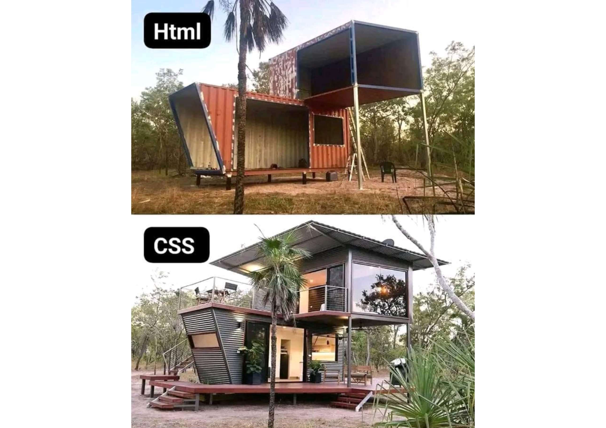

### 스크립트

비유를 통해 좀 알아보자면, HTML로 이렇게 철근 뼈대를 이렇게 딱 잡는다고 하면, CSS로 이쁘게 꾸미는 역할을 한다.

---

## 슬라이드 8 — JavaScript의 역할: 동작 처리 (p77)

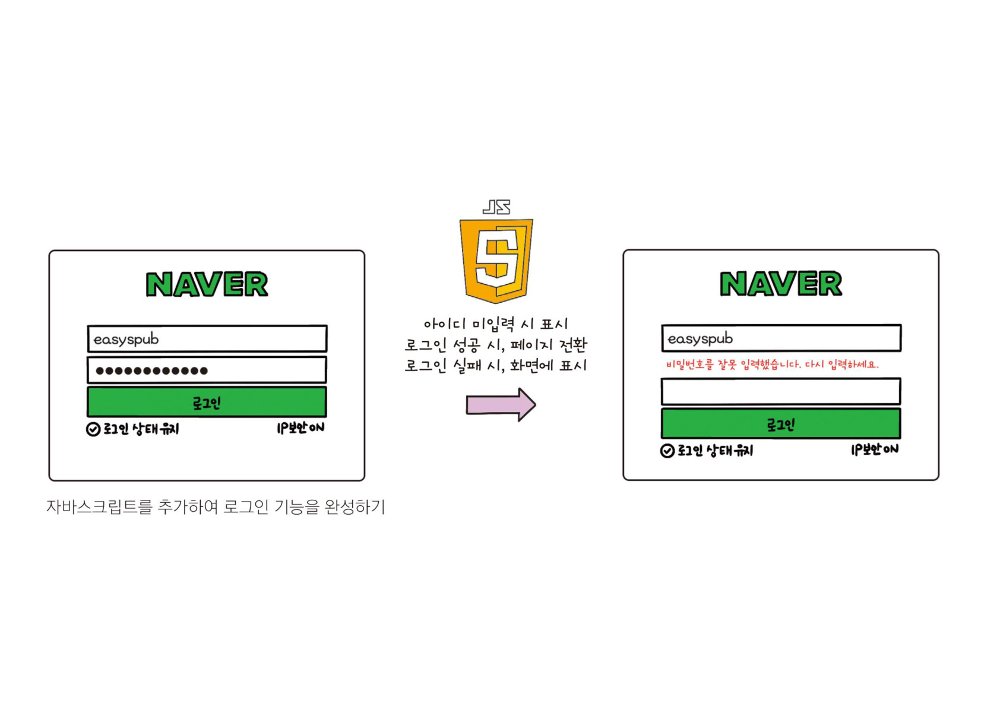

### 스크립트

그 다음에 자바스크립트 이런 걸 합니다. 동작을 처리합니다. 예를 들어서 아이디 비번 입력했는데 이런 거 띄워주잖아요. 비밀번호를 잘못 입력했습니다 다시 입력하세요라고 비번 지우고 메시지 표시하고, 클릭하면 이벤트가 발생하고 바뀌고 이런 것들을 이제 자바스크립트가 처리합니다. 즉 동적인 처리를 할 때 씁니다. 로그인 성공하면 뭘 한다, 실패하면 뭘 한다 그런 걸 설계하는 게 이 자바스크립트의 역할입니다.

---

## 슬라이드 9 — HTML/CSS/JS 비유 정리 (p78)

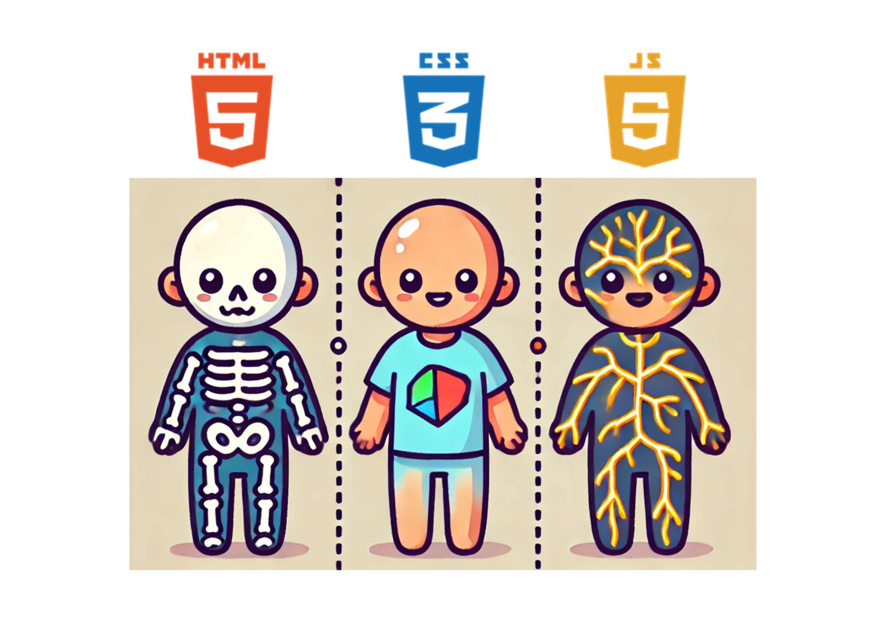

### 스크립트

이 세 가지만 이해하시면 웹 프론트엔드 사실상 끝입니다. 좀 비유적으로 또 설명을 해보자면, HTML은 뼈대를 딱 구성한다고 보시면 될 것 같고, CSS로는 이렇게 꾸미는 거, 자바스크립트는 뭐 신경 움직여야 되잖아요. 실제로 신경이 자바스크립트다 라고 이해하시면 이 역할에 대해서 개념적으로 이해하시기 좋을 것 같습니다.

---

## 슬라이드 10 — 개발 환경 세팅: 메모장 (p79)

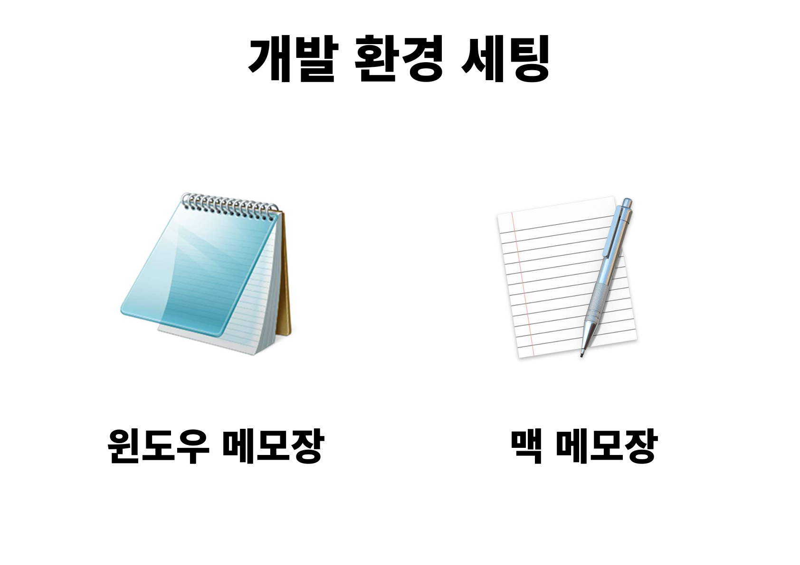

### 스크립트

그럼 이거를 직접 만들어 봐야겠죠. 근데 제가 아까 말씀드렸다시피 회원가입 설치가 가장 어려운 것 같아요. 회원가입, 그리고 어떤 걸 설치하는 거 제일 어렵기 때문에 개발 환경은 메모장을 쓰겠습니다. 윈도우 컴퓨터 쓰시는 분들은 윈도우 메모장을 쓰실 거고요. 맥 쓰신다 하시면 맥 메모장을 쓸 거잖아요.

---

## 슬라이드 11 — 개발 환경 세팅: ChatGPT (p80)

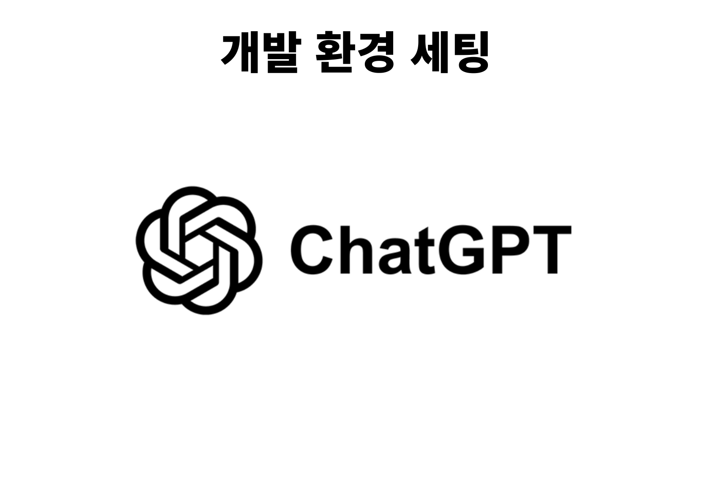

### 스크립트

나중에는 좋은 데로 갈 거긴 한데, 이해하는 데 있어서는 메모장으로 진행해보도록 하겠습니다. 그리고 ChatGPT 쓸 겁니다. 메모장과 ChatGPT, 이 두 가지로 개념을 먼저 이해를 해보도록 하겠습니다.

---

## 슬라이드 12 — HTML 문법 기초 (p81~84)

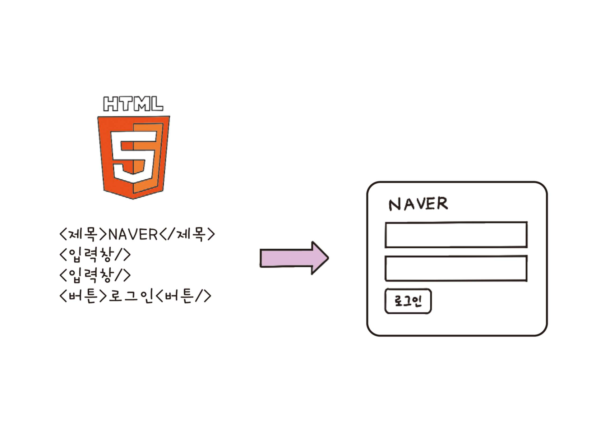

### 스크립트

일단은 좀 개념적인 걸 알고 시작하면 좋잖아요. HTML이 어떤 식으로 구성되어 있냐. 꺽쇠 연다고 하죠. 이렇게 열고 태그 이름을 쓰고 닫고, 그 안에 내용을 넣고, 꺽쇠 열고 슬래시 태그 이름하고 닫고, 이런 식으로 다 구성이 되어 있습니다.

---

## 슬라이드 13 — 키보드에서 꺽쇠 입력 (p85)

### 스크립트

이거 어떻게 써요 하시는 분들을 위해서 키보드에 Shift 누르고 요거 누르면 꺽쇠 나오고, 이 옆에 거 누르면 이제 닫는 게 나오죠. 이렇게 세 가지 이렇게 붙어 있습니다. 그래서 이런 식으로 H1이라는 HTML 태그가 있습니다. 이게 제목을 나타내는 태그인데, 이렇게 쓰는 게 이제 HTML 문법입니다.

---

## 슬라이드 14 — 실습: index.html 만들기 (p86~89)

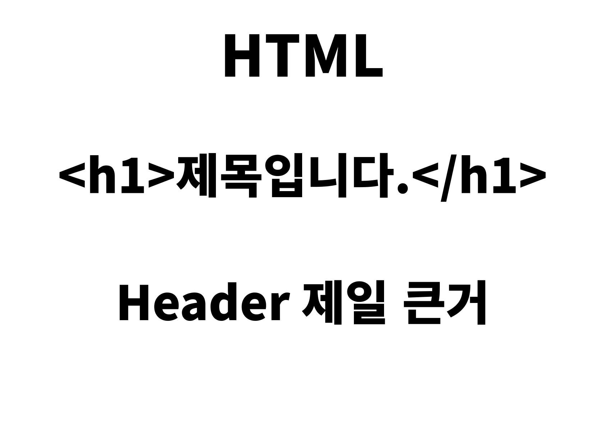

### 스크립트

윈도우 쓰시는 분들은 마우스 우클릭해 보시면 새로 만들기라는 게 있습니다. 텍스트 문서를 여기서 바로 만들 수가 있습니다. 여기서 영어로 index.html이라고 txt를 지우고 쓰시면 됩니다.

맥에 쓰신다면 기본 텍스트 에디터가 있습니다. 텍스트 에디트라는 게 있는데, 여기서 포맷을 플레인 텍스트로 바꾸셔야 됩니다. 플레인 텍스트로 바꿔가지고 이름을 index.html이라고 확장자까지 붙여가지고 저장을 하시면 됩니다.

메모장을 켜신 다음에 `<h1>안녕</h1>` 이렇게 입력하시면 됩니다. 컨트롤 S로 저장. 크롬으로 열어보면 놀랍게도 인터넷 브라우저에서 "안녕"이 표시됩니다.

---

## 슬라이드 15 — 네이버 뉴스 해킹하기 (p95)

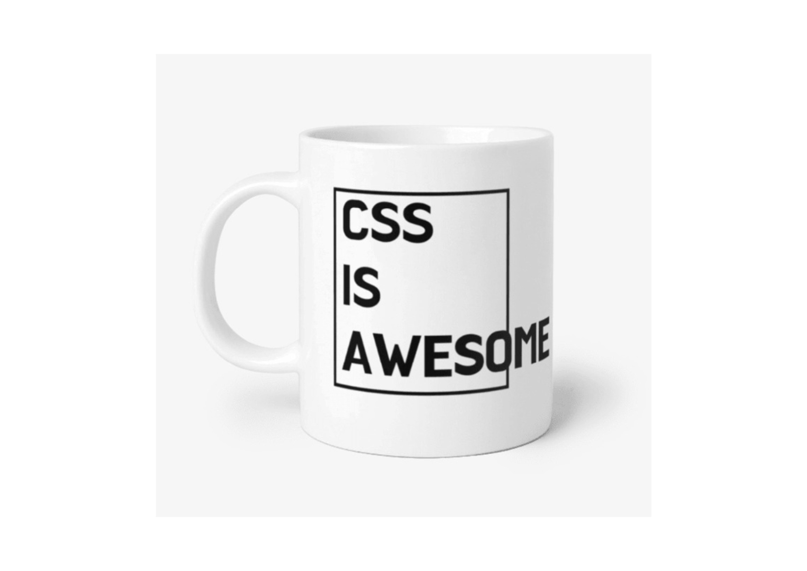

### 스크립트

놀랍게도 여러분들은 해커가 될 수가 있습니다. 네이버 뉴스를 한번 해킹해보겠습니다. 네이버 웹사이트로 들어가서 뉴스 하나 열고 마우스 우클릭하고 "검사"라는 버튼이 있습니다. 검사 누르면 갑자기 코드가 나와요. HTML이라고 써져 있는 코드가 나옵니다.

이제 HTML 개념을 이해하셨으니까 이거가 뭔지 알겠죠? 이 버튼을 누르면 특정 영역을 지정할 수도 있습니다. 뉴스의 제목을 클릭해볼게요. 이거를 지울 수가 있습니다. 놀랍게도 실제로 웹사이트가 바뀌어버립니다.

아, 진짜 해킹인 줄 아시는 분들 많은데 소개를 드리자면, 지금 한 행위는 프론트엔드 딴에서만 조작을 한 겁니다. 딴 사람들은 백엔드로 들어가서 받아오니까, 사실 여기에 있는 정보가 털리지 않으면 저 혼자 프론트엔드만 바꾼 겁니다. 이거는 제 화면만 바꾼 거다. 딴 사람들은 영향이 없습니다.

---

## 슬라이드 16 — CSS 문법 소개 (p100)

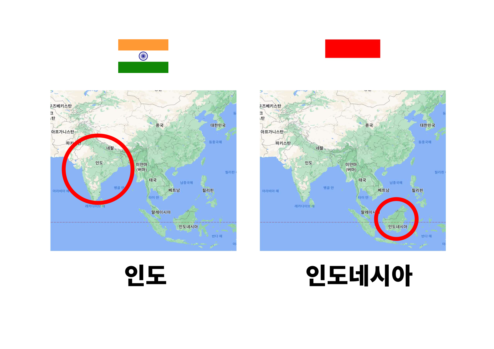

### 스크립트

CSS라는 게 아까 꾸미는 거다 라고 말씀드렸는데, HTML로 이렇게 사과라고 글씨를 브라우저로 표현했으면, CSS라는 문법을 통해서 H1 클래스는 컬러를 레드로 바꿔서 라고 이런 코드를 입력하면, 실제로 수행이 됩니다. 그냥 큰 개념만 이해하시면 돼요. 문법 필요 없습니다. CSS를 이용하면 이 요소를 이렇게 바꾸고, 요거를 이렇게 바꾸고 하는 게 가능합니다.

---

## 슬라이드 17 — JavaScript 이벤트 (p101~104)

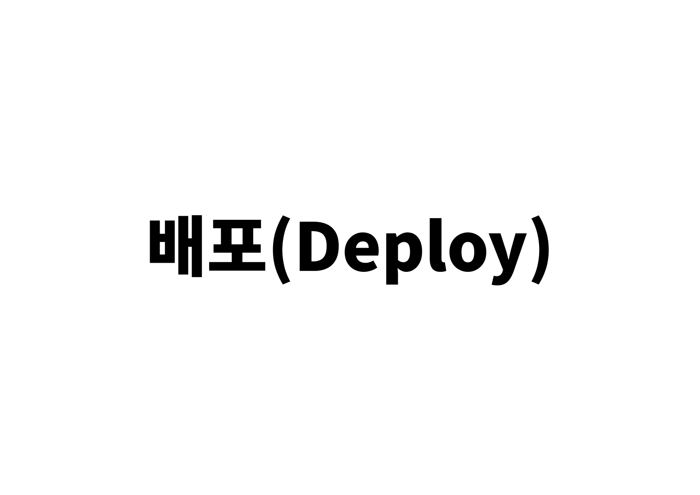

### 스크립트

자바스크립트는 말 그대로 동작을 처리한다고 말씀드렸잖아요. 브라우저를 직접 조작을 하거나 HTML, CSS를 변화시킬 수가 있습니다. 경고창을 띄워줘 하면 경고창이 나오고, 주소창을 옮겨줘 하는 거, 새로고침해줘, 뒤로 가기 해줘, 앞으로 가기 해줘, 이런 거를 자바스크립트가 수행합니다.

이벤트라는 개념도 이해하시기 어렵지 않습니다. 버튼을 클릭했을 때 사이트가 파란색으로 바뀐다, 이런 걸 이벤트라고 하는데, 이런 발생하는 거를 잡아서 자바스크립트로 변화를 시키는, 이런 행위들을 할 수 있는 게 자바스크립트라는 언어입니다.

---

## 슬라이드 18 — Java vs JavaScript (p105)

### 스크립트

좀 착각하시는 분들이 있어요. 자바에서 뭘 추가하면 자바스크립트인 거 아닌가? 아예 다른 겁니다. 자바스크립트는 인터넷 브라우저에서 조작하는 데 사용되는 언어인데, 자바는 그냥 따로 만들어진 아예 다른 언어예요. 비유를 해보자면 햄과 햄스터가 앞글자가 햄으로 같잖아요. 근데 햄과 햄스터는 아예 다르잖아요. 약간 그런 개념입니다.

---

## 슬라이드 19 — 배포란? 데이터 센터 (p105~106)

### 스크립트

지금 우리가 만든 거 그냥 내 컴퓨터에서 돌아가요. 주소를 보면 C 드라이브에 인덱스.html 이런 식으로 되어 있어요. 어? 주소가 인터넷 주소가 아니네? 왜 그러냐면 얘는 내 컴퓨터 안에 있는 겁니다.

이거를 사람들이 쓰게 하려면? 내 컴퓨터를 서버로 만들 수 있지만, 내 컴퓨터가 꺼지면 사이트를 더 이상 못 들어가잖아요. 컴퓨터를 항상 켜놔야 됩니다. 너무 불편해요.

---

## 슬라이드 20 — 클라우드 서비스 (p106)

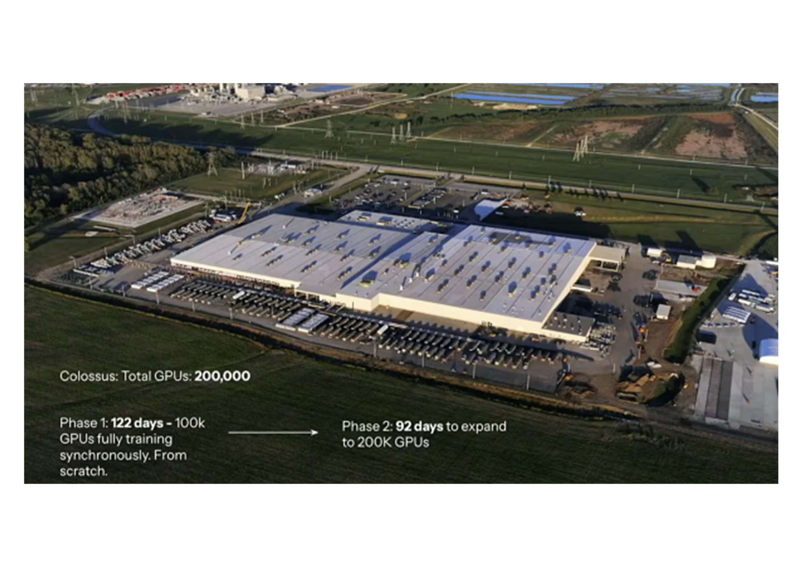

### 스크립트

요즘에 많이 하는 게 클라우드라는 걸 많이 이용하죠. 미국 데이터 센터를 막 짓는다 이런 얘기 많잖아요. 이런 데 전문적으로 관리하는 컴퓨터들이 있습니다. 컴퓨터를 24시간 365일 내내 돌리는 이런 데이터 센터들이 있습니다. 이런 데다가 컴퓨터 하나 빌려요. 이게 이제 가장 초보자들이 접근하기 쉬운 방법입니다.

이런 걸 하는 기업들이 이제 클라우드 기업들이고, AWS, 마이크로소프트 애저, 구글 클라우드, 네트리파이, 버셀, 클라우드플레어 페이지스 등등 되게 많습니다.

---

## 슬라이드 21 — 서버실 유머 (p107)

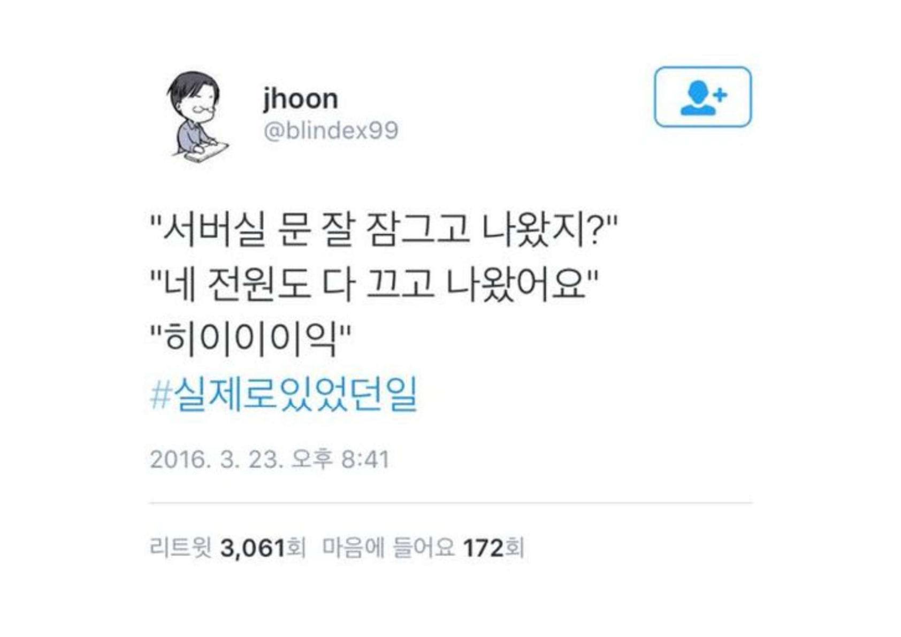

### 스크립트

"서버실 문 잘 잠그고 나왔지?" "네 전원도 다 끄고 나왔어요" "히이이이익"

내 컴퓨터가 만약에 꺼지면 내 사이트를 더 이상 못 들어가잖아요. 그래서 너무 불편해요. 내 컴퓨터에서 돌리려면.

---

## 슬라이드 22 — 배포 구조 (p108)

### 스크립트

내 컴퓨터를 항상 켜두기 어려우니까 외부 24시간 돌아가는 어떤 클라우드 서버를 빌려가지고 여기에 HTML 파일을 싹 얹어 놓게 되면, 누구나 외부 서버로 들어와가지고 내 웹사이트를 이용할 수가 있습니다. 이렇게 올리는 행위를 **배포한다**라고 합니다.

---

## 슬라이드 23 — Cloudflare Pages (p110)

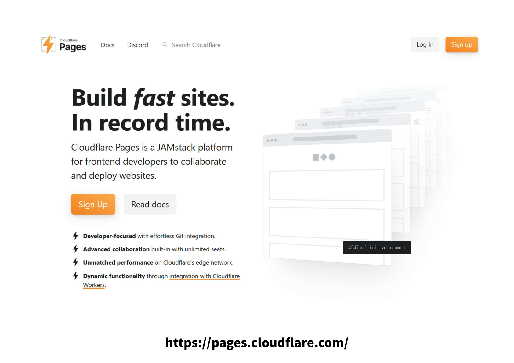

### 스크립트

클라우드 업체 중에 저희는 클라우드플레어 페이지스라는 것을 쓸 겁니다. 이걸 왜 쓰냐? 가장 중요한데, 클라우드플레어가 어떤 게 가장 강점이냐면 공짜 플랜인데도 Unlimited Bandwidth를 제공합니다. 이런 데가 지금 클라우드플레어밖에 없거든요. 아무리 전 세계 인구가 내 사이트로 다 들어간다 하더라도 비용은 공짜입니다.

---

## 슬라이드 24 — 인터넷 인프라와 Cloudflare (p112)

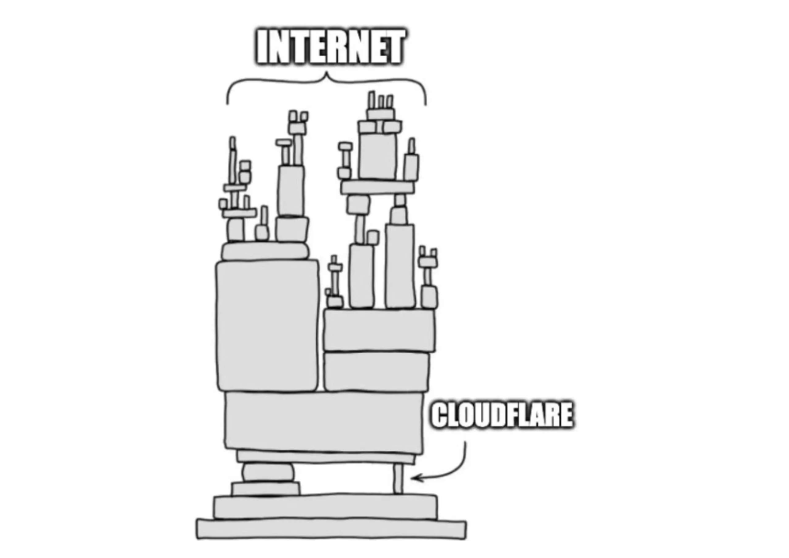

### 스크립트

이런 화면 혹시 보신 적 있으신가요? 최근에 뭐 챗GPT라던가 뭐 웬만한 서비스는 이렇게 장애가 났었거든요. 클라우드플레어가 가끔 이렇게 맛이 갑니다. 그러면 전 세계 인터넷이 마비가 돼요. 클라우드플레어가 하나 무너지면 다 안됩니다. 인터넷 세계가 사실 생각보다 취약합니다.

---

## 참고: 우리 교육에서 달라지는 점

> 아래 내용은 발표 시 보충 설명용입니다.

### 1. claude.ai 링크 공유 vs Supabase + Vercel 연동

| 항목 | claude.ai 링크 공유 | Supabase + Vercel |
|------|-------------------|-------------------|
| 장점 | 즉시 공유 가능, 설치 불필요 | 본격적인 웹 서비스 구축 가능, DB 포함 |
| 단점 | 커스터마이징 불가, 도메인 없음 | 가입/연동 필요 |
| 적합한 용도 | 프로토타입 시연, 빠른 공유 | 실제 사용자가 쓰는 서비스 |

### 2. 외부 서비스 vs 직접 서버 구축

외부 서비스(Supabase, Vercel)를 이용하면 백엔드/프론트 서비스 구축이 편하지만, 실제 개발에서는 서버를 직접 구축해야 확장성이나 비용 면에서 무료로 사용이 가능합니다. 교육에서는 먼저 외부 서비스로 빠르게 경험하고, 이후 직접 구축하는 흐름으로 진행합니다.
