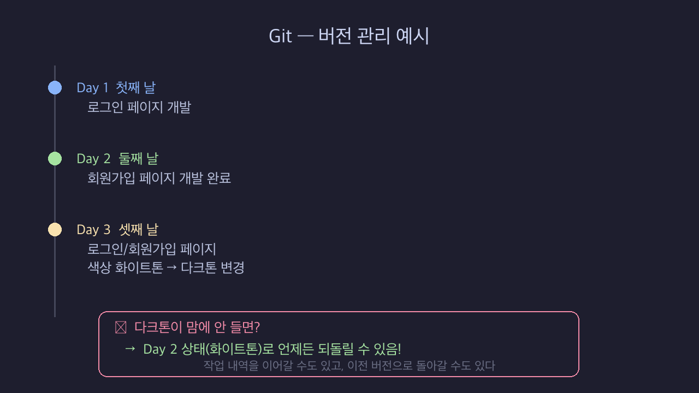
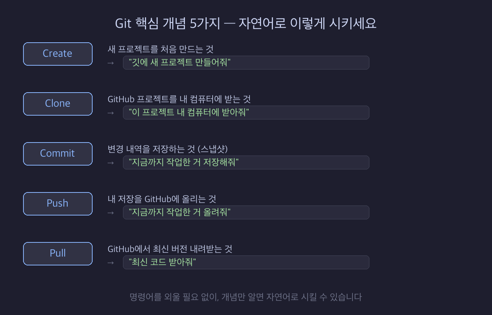
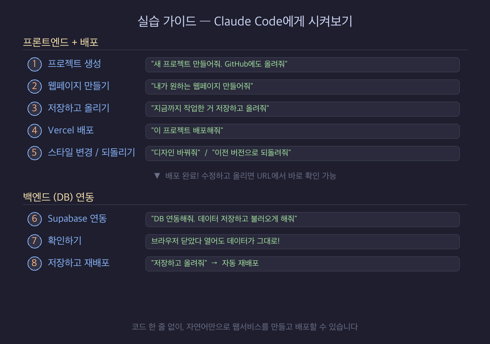

# 바이브코딩으로 배포까지 — 3회차 강의자료

> 참고 영상: https://youtu.be/P3jFI-VpyLg (13:11 ~ 37:03)
> 원본 PDF: [1주차]AI Product Builder (p70~p112)

---

## 슬라이드 1 — 웹 개발 기초 (p70)

오늘 강의 주제는 웹 개발 제품을 어떻게 배포하는지 강의 및 실습 진행 해볼건데요.

강의자료를 만들다 보니 이제 여러분들이 실제 프로그램을 배포하시게 되는 입장에서 프론트엔드와 백엔드를 개념적으로 이해하고 나서 배포를 실습을 하는게 매우 중요 하다고 생각합니다. 배포 실습까지 2회로 세션을 나누는 한이 있더라도 눈 높이에 맞춰서 프론트/백엔드 개념 이해부터 진행 하겠습니다.

이제 웹 개발 바로 진행해 보도록 하겠습니다.

---

## 슬라이드 2 — 웹 개발이란? (p71)

일단 웹 개발이란, 크롬 브라우저는 한 번씩 좀 써보셨죠? 브라우저를 통해서 접근해서 이용할 수 있는 이런 서비스, 네이버, 구글, 유튜브, 쿠팡, 지금 열심히 만드시고 계신 대시보드 같은 것들이 다 웹 서비스입니다. 이걸 개발하는 과정이 웹 개발입니다.

그래서 이걸 왜 하냐? 제가 봤을 때 가장 난이도도 낮으면서 이해하기도 좋고, 인터넷에 한 번쯤 어떤 사이트 들어가 본 건 해보셨을 거잖아요. 그래서 익숙하면서 내가 만든 어떤 것도 구글이나 똑같이 전 세계 누구나 쓸 수 있게 만드는 게 어렵지가 않습니다.

---

## 슬라이드 3 — 프론트엔드와 백엔드 (p72)

그래서 아까 소개 드렸듯이 웹 사이트도 마찬가지로 프론트엔드 클라이언트 부분과 백엔드 서버 부분이 있습니다. 서버 쪽은 약간은 좀 난이도가 있을 수 있어요. 이 프론트엔드 화면 만드는 건 그나마 좀 직관적으로 이해하기 좋거든요. 그래서 이렇게 왔다 갔다 할 거지만, 프론트엔드를 먼저 배운다라고 이해해 주시면 좋을 것 같습니다.

---

## 슬라이드 4 — HTML, CSS, JavaScript (p73)

그래서 이 프론트엔드, 웹의 프론트엔드는 진짜 별거 없습니다. 이 세 가지 언어를 아시면 끝납니다. HTML, CSS, JavaScript. 이 세 개의 언어로 이 웹 개발이 구성이 되어 있습니다.

아니, 웹 개발 쉽다면서 무슨 언어를 세 개나 써가지고 개발하냐라고 생각이 들 수 있는데, 사실 크게 어렵지 않습니다. 심지어 문법은 이제 몰라도 됩니다. 역할만 알면 됩니다. 아, HTML이 이런 걸 하는 거고, CSS가 이런 걸 하는 거고, 자바스크립트가 이런 걸 하는 거다 정도만 알면 AI한테 "HTML 코드 만들어줘" 하면 만들어주고, "CSS 코드 만들어줘" 하면 만들어주고, 그 개념만 알면 되지 세부적인 문법은 이제 AI 시대에 알 필요가 없다라고 소개를 드립니다.

간혹 "저는 JAX로 만들었는데요?", "React나 Vue로 만들었는데 HTML, CSS, JS가 아닌데요?" 하시는 분들이 계실 수 있는데, 사실 React, Vue, Next.js 같은 프레임워크들도 결국 내부적으로는 전부 HTML, CSS, JavaScript로 변환되어서 브라우저에서 동작합니다. 겉모습이 다르게 보일 뿐이지 근본은 똑같은 겁니다. 그래서 이 세 가지 기초 개념만 잡아두면 어떤 프레임워크를 쓰든 이해할 수 있고, AI한테 시킬 때도 훨씬 정확하게 요청할 수 있습니다.

---

## 슬라이드 5 — HTML의 역할: 뼈대 (p74)

그러면 이제 각각 언어의 역할을 알아보도록 하겠습니다. HTML은 뭐 하는 거냐? 이렇게 뼈대를 잡는 역할을 합니다. 네이버 로그인 페이지를 만든다라고 하면 제목은 네이버 이렇게 들어가 있고, 입력창 만들고, 로그인 버튼을 만든다. 요렇게 구성하는 어떤 뼈대를 잡는 게 HTML의 역할입니다. 뼈대는 HTML이다. 어렵지 않죠?

---

## 슬라이드 6 — CSS의 역할: 꾸미기 (p75)

그 다음에 이제 CSS라는 걸 좀 알아보자면, 아까 HTML로 이렇게 뼈대를 잡았잖아요. 요거를 이렇게 꾸며주는 역할을 합니다. 제목은 초록색으로, 글씨, 폰트는 뭐고 배경은 회색이었으면 좋겠다 하면 회색으로 하고, 입력창은 흰색이고, 요런 걸 설정하는 게 CSS라고 합니다. 꾸미는 역할을 하는 게 CSS다 이해해주시면 좋을 것 같습니다.

---

## 슬라이드 7 — HTML vs CSS 비유 (p76)

비유를 통해 좀 알아보자면, HTML로 이렇게 철근 뼈대를 이렇게 딱 잡는다고 하면, CSS로 이쁘게 꾸미는 역할을 한다.

---

## 슬라이드 8 — JavaScript의 역할: 동작 처리 (p77)

그 다음에 자바스크립트 이런 걸 합니다. 동작을 처리합니다. 예를 들어서 아이디 비번 입력했는데 이런 거 띄워주잖아요. 비밀번호를 잘못 입력했습니다 다시 입력하세요라고 비번 지우고 메시지 표시하고, 클릭하면 이벤트가 발생하고 바뀌고 이런 것들을 이제 자바스크립트가 처리합니다. 즉 동적인 처리를 할 때 씁니다. 로그인 성공하면 뭘 한다, 실패하면 뭘 한다 그런 걸 설계하는 게 이 자바스크립트의 역할입니다.

---

## 슬라이드 9 — HTML/CSS/JS 비유 정리 (p78)

이 세 가지만 이해하시면 웹 프론트엔드 사실상 끝입니다. 좀 비유적으로 또 설명을 해보자면, HTML은 뼈대를 딱 구성한다고 보시면 될 것 같고, CSS로는 이렇게 꾸미는 거, 자바스크립트는 뭐 신경 움직여야 되잖아요. 실제로 신경이 자바스크립트다 라고 이해하시면 이 역할에 대해서 개념적으로 이해하시기 좋을 것 같습니다.

---

## 슬라이드 10 — 개발 환경 세팅: 메모장 (p79)

가장 기본적인 메모장으로도 개발이 가능하구요. 저는 vscode에서 예시를 보여드리겠습니다. 편집기 기능 자체는 메모장과 vscode랑 100% 동일합니다. 

---

## 슬라이드 11 — 개발 환경 세팅: Claude Code (p80)

claude Code, 이 두 가지로 개념을 먼저 이해를 해보도록 하겠습니다.
지난 강의 때 다 설정 하셨죠. 이제 AI 바이브코딩 시대에 비 개발자분들이 결과물도 잘 만들어내시는데 특히 환경 세팅이 가장 큰 숙제가 되었더라구요.
근데 셋팅은 장비를 바꾸지 않는 이상 딱 1번만 하면 끝입니다. AI랑 차분하게 한스텝씩 진행하시면 막힘없이 진행 가능합니다.

---

## 슬라이드 12 — HTML 문법 기초 (p84)

일단은 좀 개념적인 걸 알고 시작하면 좋잖아요. HTML이 어떤 식으로 구성되어 있냐. 꺽쇠 연다고 하죠. 이렇게 열고 태그 이름을 쓰고 닫고, 그 안에 내용을 넣고, 꺽쇠 열고 슬래시 태그 이름하고 닫고, 이런 식으로 다 구성이 되어 있습니다.

---

## 슬라이드 13 — 키보드에서 꺽쇠 입력 (p85)

이거 어떻게 써요 하시는 분들을 위해서 키보드에 Shift 누르고 요거 누르면 꺽쇠 나오고, 이 옆에 거 누르면 이제 닫는 게 나오죠. 이렇게 세 가지 이렇게 붙어 있습니다. 그래서 이런 식으로 H1이라는 HTML 태그가 있습니다. 이게 제목을 나타내는 태그인데, 이렇게 쓰는 게 이제 HTML 문법입니다.

---

## 슬라이드 14 — 실습: index.html 만들기 (p86~89)

윈도우 쓰시는 분들은 마우스 우클릭해 보시면 새로 만들기라는 게 있습니다. 텍스트 문서를 여기서 바로 만들 수가 있습니다. 여기서 영어로 index.html이라고 txt를 지우고 쓰시면 됩니다.

맥에 쓰신다면 기본 텍스트 에디터가 있습니다. 텍스트 에디트라는 게 있는데, 여기서 포맷을 플레인 텍스트로 바꾸셔야 됩니다. 플레인 텍스트로 바꿔가지고 이름을 index.html이라고 확장자까지 붙여가지고 저장을 하시면 됩니다.

메모장을 켜신 다음에 `<h1>안녕</h1>` 이렇게 입력하시면 됩니다. 컨트롤 S로 저장. 크롬으로 열어보면 놀랍게도 인터넷 브라우저에서 "안녕"이 표시됩니다.

---

## 슬라이드 15 — 뉴스 해킹하기 (p90)

> 실습 예제 1: https://n.news.naver.com/mnews/ranking/article/003/0013889963
>
> 실습 예제 2: https://n.news.naver.com/mnews/article/003/0007497691

이걸 알면 뭐 할 수 있냐? 놀랍게도 방금 배운 개념으로 여러분들은 해커가 될 수가 있습니다. 뉴스를 한번 해킹해보겠습니다. 뉴스 웹사이트로 들어가 보겠습니다. 뉴스로 들어가서 IT 뉴스 하나 보겠습니다. 내용이랑 상관없이 그냥 아무거나 들어가시면 됩니다. 

그 다음에 마우스 우클릭하고 "검사"라는 버튼이 있습니다. 검사 누르면 갑자기 이렇게 코드가 나와요. 오른쪽에 보면 이런 HTML이라고 써져 있는 어떤 코드가 나옵니다. 이제 HTML 개념을 이해하셨으니까 이거가 뭔지 알겠죠? 

마우스를 움직일 때마다 이게 어느 영역을 표현하고 있는 이 프론트엔드 코드구나라는 걸 이해할 수가 있습니다. 그래서 이 버튼을 누르면 이렇게 특정 영역을 지정할 수도 있습니다. 

예를 들어 제목을 변경해볼게요 웹사이트가 바뀌어버립니다. 그래서 기사를 조작을 해버릴 수가 있습니다. 이미지 이런 것도 바꿔볼게요. 여기서 이미지를 마우스 우클릭해가지고 이미지 주소 복사가 있거든요. 이 주소를 복사해서 여기서 이미지에 이런 주소가 들어있습니다. 얘를 더블클릭하고 SRC 안에 따옴표 안에 얘를 붙여넣으면 제 사진이 들어갑니다. 와, HTML만 이해해도 이렇게 해킹이 가능합니다. 
방금 html코드를 보고 직접 수정도 해봤습니다. 

---

## 슬라이드 15-1 — 프론트엔드 vs 백엔드 구조

아, 진짜 해킹인 줄 아시는 분들 많은데 좀 소개를 드리자면, 지금 한 행위는 뭐냐면 뉴스 기사를 막 조작했죠. 그러면 얘는 프론트엔드 단에서만 이렇게 조작을 한 겁니다. 그러니까 백엔드는 안 건드렸잖아요. 그래서 이 구조가 어떻게 돼 있냐면 이런 식으로 돼 있습니다. 그래서 결국에 어떤 뉴스 기사를 조작한 제 컴퓨터의 인터넷 브라우저는 여기 있고, 이 프론트엔드 부분을 제가 조작한 거잖아요. 딴 사람들은 어떻게 접속하냐면 백엔드로 들어가서 받아오니까, 사실 여기에 있는 정보가 털리지 않으면 얘는 그냥 저 혼자 프론트엔드만 바꾼 겁니다. 이거는 제 화면만 바꾼 거다. 딴 사람들은 영향이 없습니다. 딴 사람들은 그냥 똑같이 접속을 하겠죠. 그래서 프론트엔드를 바꾸면 이걸 바꿀 수 있다. 즉 백엔드와 프론트엔드의 차이를 보여드리기 위해 이 정도로 이렇게 소개를 드릴 수 있을 것 같고요.

---

## 슬라이드 16 — CSS: HTML에 사과 표시 (p91)

CSS라는 게 아까 꾸미는 거다 라고 말씀드렸는데, HTML로 이렇게 사과라고 글씨를 브라우저로 표현했으면,

---

## 슬라이드 17 — CSS: 컬러를 레드로 (p92)

요거를 CSS라는 문법을 통해서 H1 클래스는 컬러를 레드로 바꿔서 라고 이런 코드를 입력하면, 요게 동작해 가지고 이렇게 실제로 수행이 됩니다.

---

## 슬라이드 18 — CSS: ID로 개별 스타일 (p93)

그래서 이런 식으로 가능합니다. 아이디라는 걸 지정해 가지고 애플이라는 아이디를 레드로 바꾸고, 그레이비라는 아이디를 퍼플로 바꾸면, 얘가 이렇게 반영되고 얘가 이렇게 반영되고 이런 식으로 동작을 합니다. 그냥 큰 개념만 이해하시면 돼요. 문법 필요 없습니다. 그냥 CSS를 이용하면 이 요소를 이렇게 바꾸고, 요거를 이렇게 바꾸고 하는 게 가능합니다.

---

## 슬라이드 19 — JavaScript: 브라우저 조작 + HTML/CSS 변화 (p96)

그 다음에 이제 자바스크립트 들어가 볼 텐데, 자바스크립트는 말 그대로 동작을 처리한다고 말씀드렸잖아요. 자바스크립트로는 뭘 할 수 있냐면, 브라우저를 직접 조작을 하거나 HTML, CSS를 변화시킬 수가 있습니다. 이렇게 두 가지 역할을 수행합니다. 그래서 경고창을 띄워줘 하면, 이렇게 버튼 클릭하면 경고창이 나오는 거, 이런 거 만들 수가 있고요. 주소창을 구글 닷컴에서 네이버 닷컴으로 옮겨줘 하는 거, 그 새로 고침해줘, 뒤로 가기 해줘, 앞으로 가기 해줘, 이런 거를 이제 자바스크립트가 수행할 수 있고요. HTML, CSS 이것도 변화를 시킬 수가 있습니다. 그래서 버튼을 클릭했을 때 제목이 뭘로 바뀐다, 이런 게 이제 자바스크립트의 역할이다, 라고 이해하시면 거의 큰 그림은 다 이해하신 겁니다.

---

## 슬라이드 20 — JavaScript: 이벤트 (p97)

이벤트라는 개념도 이해하시기 어렵지 않습니다. 이벤트라는 걸 이용해서 브라우저나 HTML, CSS 변화를 시킬 수가 있는데, 이벤트가 발생하면 이렇게라는 거를 어떤 조건으로 설정을 해둘 수가 있습니다. 예를 들어 버튼을 클릭했을 때 사이트가 파란색으로 바뀐다, 이런 거 있잖아요. 이런 걸 이벤트라고 하고 이런 행위들을 할 수 있는 게 자바스크립트라는 언어입니다. 이거까지 이해하시면 이제 프론트엔드 거의 사실상 끝났다고 보시면 될 것 같습니다.

---

## 슬라이드 21 — Java ≠ JavaScript (p98)

좀 착각하시는 분들이 있어요. 자바에서 뭘 추가하면 자바스크립트인 거 아닌가? 이런 느낌으로 생각할 수가 있을 것 같은데, 아예 다른 겁니다. 자바스크립트는 이제 인터넷 브라우저에서 조작하는 데 사용되는 언어인데, 자바는 그냥 따로 만들어진 아예 다른 언어예요.

---

## 슬라이드 22 — 햄 vs 햄스터 (p99)

비유를 해보자면 햄과 햄스터가 앞글자가 햄으로 같잖아요. 근데 햄과 햄스터는 아예 다르잖아요. 약간 그런 개념입니다. 그냥 이름이 비슷하다라고 이해하시면 좋을 것 같습니다. 그럼 여기까지 이해하시면 이제 프론트엔드의 그 큰 개념은 사실상 다 이해하신 거라고 보시면 되겠습니다.

이제 한번 본인이 생성했던 html 보시면 구조가 보일 겁니다.

---

## 슬라이드 23 — 배포(Deploy) 타이틀 (p101)

그 다음에 이제 다음 진도를 나가보겠습니다.  배포를 들어가 보도록 하겠습니다.

---

## 슬라이드 24 — 내 컴퓨터에서만 돌아간다 (p102)

지금 우리가 만든 거 그냥 내 컴퓨터에서 돌아가요. 얘를 클릭해야지만 사이트가 열리잖아요. 그래서 실제로 여러분들 만드신 걸 주소를 보면은 이렇게 돼 있습니다. 아까 제가 잠깐 실습에서 보여드렸던것처럼 C 드라이브에 인덱스.html 이런 식으로 돼 있거나, localhost:3000 이런 식으로 돼 있어요. 어? 주소가 인터넷 주소가 아니네? 라고 생각이 들잖아요. 왜 그러냐면 얘는 내 컴퓨터 안에 있는 겁니다.

---

## 슬라이드 25 — 배포 방법 두 가지 (p103)

그래서 이거를 사람들이 쓰게 하려면 두 가지 방법이 있습니다. 내 컴퓨터를 서버로 만들어요. 그래서 사람들이 내 컴퓨터로 접속해서 가져갈 수 있게 만들 수가 있습니다. 아니면 외부 컴퓨터를 빌려 가지고 거기다가 웹사이트를 런칭하고 그거를 다운받아가게 할 수도 있죠.

---

## 슬라이드 26 — 내 컴퓨터를 서버로 (p104)

일단 내 컴퓨터를 연다고 하면 약간 복잡합니다. 내 컴퓨터가 서버가 되는 겁니다. 얘를 서버로 만들어요. 그러면 이 IP 주소가 있거든요. 주소를 알면 다른 사람들이 내 컴퓨터로 들어와서 이걸 볼 수가 있어요. 그러면 좀 불안하겠죠. 해킹당할 수도 있을 것 같고 아니면 내 컴퓨터가 만약에 꺼졌다 내 사이트를 더 이상 못 들어가잖아요. 그러니까 컴퓨터를 항상 켜 놔야 됩니다. 그래서 너무 불편해요.

---

## 슬라이드 27 — 서버실 내부 (p105)

---

## 슬라이드 29 — 데이터 센터 (p106)

요즘에 많이 하는 게 클라우드라는 걸 많이 이용하죠. 아마 이런 거 한번 보신 적 있으신가요? 미국 데이터 센터를 막 짓는다 이런 얘기 많잖아요. 그래서 이런 데 막 큰 데다가 이렇게 이런 시설을 짓습니다. 이렇게 전문적으로 관리하는 컴퓨터들이 있습니다. 컴퓨터를 오래 틀어놓으면 따뜻해지거든요. 그래서 얘를 냉각도 시키고 환기도 시키고 하면서 컴퓨터를 24시간 365일 내내 돌리는 이런 데이터 센터들이 있습니다. 그래서 이런 데다가 컴퓨터 하나 빌려요. 이게 이제 가장 초보자들이 접근하기 쉬운 방법입니다. 그러면 이런 걸 운영하는 기업들이 되게 많을 거잖아요. 그래서 이런 거를 하는 기업들이 이제 클라우드 기업들이고, 여기서 털면 이제 진짜 서버에 있는 회원 정보나 개인 정보 이런 거 싹 털어갈 수 있겠죠.

---

## 슬라이드 29 — 배포 구조 (p108)

이렇게 서버라는 개념 이해를 하셨으면 이제는 배포하는 개념을 이해하실 수가 있습니다. 내 컴퓨터를 항상 켜두기 어려우니까 외부 24시간 돌아가는 어떤 클라우드 서버를 빌려 가지고 여기에 HTML 파일을 싹 얹어 놓게 되면, 이제 이 HTML은 누구나 외부 서버로 들어와 가지고 받아 가니까 내 컴퓨터는 이제 털릴 일이 없죠. 그래서 딴 사람들이 이렇게 접속해 가지고 내 웹사이트를 이용할 수가 있습니다. 그러면 이렇게 올리는 행위를 **배포한다**라고 합니다.

---

## 슬라이드 31 — 클라우드 서비스 목록 (p109)

그래서 대표적으로 아마 많이 들어보셨을 게 AWS가 클라우드 사업한다 이런 거 많이 들어보셨죠? 아마존 웹 서비스. 아니면 마이크로소프트 애저 해 가지고 클라우드 브랜드가 있고,  그 외에도 네트리파이, 버셀, 클라우드 플레어 페이지스 등등 되게 많습니다.

---

## 슬라이드 32 — Vercel로 배포

이제 직접 배포를 해보도록 하겠습니다. 클라우드 업체 중에 저희는 Vercel이라는 것을 쓸 겁니다. 조건부 무료이면서 Vercel은 GitHub이랑 연동이 되어 있어서, 코드를 GitHub에 올리면 자동으로 배포가 됩니다. 별도로 뭘 설정할 필요가 없어요. 비개발자 분들이 깃이라는 장벽만 넘어가면 매우 편리하게 배포가 가능합니다. 깃에서 push 한 번이면 전 세계에 배포가 끝납니다. 무료 플랜으로도 개인 프로젝트는 충분하고, Next.js 같은 프레임워크와 궁합이 아주 좋습니다. 그리고 Supabase를 백엔드로 연결하면 DB, 인증, 스토리지까지 한 번에 해결됩니다.

---

## 슬라이드 33 — claude.ai 게시 vs 실제 배포 차이

그러면 여기서 궁금하실 수 있는 게, claude.ai에서도 아티팩트를 게시하면 링크가 나오고 공유할 수 있잖아요. 그거랑 뭐가 다르냐? 차이가 큽니다.

| 항목 | claude.ai 아티팩트 게시 | Vercel + Supabase 배포 |
|------|---------------------|----------------------|
| **소유권** | Anthropic 서버에 종속. 내 거 아님 | 내 도메인, 내 코드, 내 DB. 완전히 내 거 |
| **도메인** | `claude.site/...` 고정. 커스텀 불가 | 내 도메인 연결 가능 |
| **백엔드/DB** | 없음. 프론트엔드만 가능 | Supabase로 DB, 인증, 스토리지 전부 가능 |
| **지속성** | Anthropic이 중단하면 끝. SLA 없음 | 내가 삭제 전까지 영구 운영 |
| **용도** | 데모, 포트폴리오 미리보기, 빠른 공유 | 실제 고객이 쓰는 서비스, 상용 제품 |

### Q&A 대비

> **Q: claude.ai 웹 채팅형 AI에서 프로그램 만들고 게시하면 외부에 공유되는 사례**
>
> A: 맞습니다, 클로드가 임시로 서버를 제공해주는 겁니다. 근데 핵심은 "임시"라는 거예요. 클로드가 만들어준 링크는 클로드 서버 위에서 돌아가는 거라서, 클로드가 그 서비스를 중단하거나 링크가 만료되면 끝입니다. 내 거가 아니에요. 도메인도 클로드 거고, 데이터도 클로드 서버에 있고, 커스터마이징도 제한적입니다. 진짜 내 서비스를 만들려면 GitHub에 코드를 올리고, Supabase로 DB 연결하고, Vercel 같은 데서 배포해야 합니다. 그래야 내 도메인, 내 데이터, 내 서비스가 되는 거죠. 오늘 실습에서 그걸 해볼 겁니다.
한 마디로 claude.ai 게시는 **"이런 거 만들었어요" 보여주기용**이고, Vercel+Supabase는 **"이걸로 사업합니다" 운영용**입니다. 오늘 실습에서 그 운영용 배포를 직접 해볼 겁니다.

---

## 슬라이드 34 — Git: 버전 관리 도구

깃허브 전에 깃 개념이 있습니다. 깃은 버전 관리 도구인데, 예를 들면 졸업논문 쓰면 계속 계속 수정 사항 생기죠? 코드도 똑같습니다. 다크모드 추가하고 색상 바꾸고 기능 추가하고 계속 수정 사항 만들다 보면 헷갈립니다. 언제 어디에서 바꿨고 이게 무슨 버전이지? 누가 수정했지? 이런 거를 관리하는 도구가 깃입니다.

https://github.com/naviproject25/AXProject/
활동 내역을 보면 누가 언제 어떤기능을 추가했고 뭐가 변경 됬는지 다 확인이 가능

예를들어 XXX 위원님이 
첫날 로그인 페이지 개발
두번째날 회원가입 페이지 개발 완료
세번째날 로그인/회원가입 페이지 색상 화이트톤 -> 다크톤 변경.
작업 내역을 이어 갈수도 있고 다크톤 변경했는데 맘에 안들면 다시 돌아 갈 수있음 화이트톤 작업으로

자, 그러면 Git에서 꼭 알아야 할 개념이 뭐가 있냐. 딱 다섯 가지만 알면 됩니다. Create, Clone, Commit, Push, Pull. 이름이 좀 어려워 보이는데 하나씩 보면 별거 아닙니다. Create는 새 프로젝트를 처음 만드는 거, Clone은 GitHub에 있는 프로젝트를 내 컴퓨터에 받아오는 거, Commit은 내가 작업한 내역을 저장하는 거 — 아까 그 스냅샷이죠, Push는 저장한 걸 GitHub에 올리는 거, Pull은 GitHub에서 최신 버전을 내려받는 거. 이 다섯 개가 Git의 전부입니다.

그러면 이걸 쓰려면 명령어를 외워야 하냐? 아닙니다. 그림에 나와 있는 것처럼 그냥 자연어로 시키면 됩니다. "새 프로젝트 만들어줘", "이 프로젝트 현재 폴더에 받아줘", "저장해줘", "올려줘", "최신 코드 받아줘" 이렇게만 말하면 AI가 알아서 해줍니다. 명령어를 외울 필요가 전혀 없어요.

어렵게 생각하지마시고 각 역할이 어떤거다 역할을 명확하게 이해하시면 되고 
막상 실제로 셋팅해놓고 혼자 작업하면 딱 1개만 써요  "작업한거 올려"

오늘 교육의 꽃이 이 깃이기 떄문에 이해 하나라도 안가면 이해갈때까지 질문 받겠습니다.
이거 깃 지금 이해 안가면 안되서 제가 천천히 시뮬레이션 해볼게요
처음에 바이브 코딩으로 코드를 만들었으면 저장소에 올려야 겠죠? 그럼 Create 하시면되요. 
그리고 무언가 작업을 하면 커밋앤푸시
다른 피시에서 이걸 이어서 작업하고 싶어 그럼 클론
그리고 만약 협업을 하는데 A작업자가 작업을해서 올리면 B 작업자가 현재 A작업자까지 작업한걸 받고 싶고 최신상태로 유지하고 싶으면 Pull

---

## 슬라이드 36 — GitHub: 코드 저장소

이걸 클라우드에 얹어서 코드를 저장하는 곳이 깃허브입니다.

---

## 슬라이드 37 — Git + Supabase + Vercel = 웹서비스 배포

자, 그러면 정리해보겠습니다. 우리가 오늘 실습에서 쓸 도구는 이 세 가지입니다. Git으로 소스코드를 관리하고, Supabase를 통해서 백엔드 — 데이터베이스, 인증 이런 걸 구축하고, Vercel로 배포합니다.

사실 Git + Vercel 두 개만으로도 웹사이트를 만들어서 배포할 수 있습니다. 단순한 소개 페이지, 포트폴리오 사이트 같은 건 그걸로 충분해요. 그런데 로그인 기능이 필요하다든지, 사용자가 글을 쓰고 저장해야 한다든지, 데이터를 쌓아서 보여줘야 한다면 — 그건 데이터를 어딘가에 저장할 곳이 필요합니다. 그게 바로 데이터베이스고, Supabase가 그 역할을 해줍니다. 결국 "데이터를 다루는 서비스"를 만들려면 Supabase 같은 백엔드가 필요한 거죠.

이 세 가지만 연결하면 여러분도 실제 서비스를 운영할 수 있습니다. 전부 무료로 시작할 수 있고, 코드 한 줄 안 치고 Claude Code한테 자연어로 시키면 됩니다. 그럼 바로 실습으로 들어가보겠습니다.
실습할 때 초기 셋팅이 낯설어서 좌절하실 필요 없습니다. 제안서도 한번 템플릿을 만들어 놓으면 다음부터는 처음부터 안 쓰고 조금만 수정하잖아요. 개발 환경 셋팅도 똑같습니다. 한 번만 해놓으면 거의 다시 볼 일이 없고, 뭔가 새로 추가되거나 할 때만 잠깐 건드리는 겁니다. 개발자들도 셋팅은 처음 한 번이 제일 귀찮고, 그 이후로는 신경 쓸 일이 거의 없어요.

---

## 실습 — Claude Code에게 시켜보기

먼저 제가 빠르게 A to Z로 프로젝트 생성하는 과정을 한번 보여드리겠습니다. 전체 흐름을 먼저 보시고, 그다음에 여러분이 직접 저랑 한 스텝씩 같이 해보는 걸로 진행하겠습니다.

오늘 실습은 2단계로 진행합니다. 1단계에서 오늘의 운세 프로그램을 만들어서 배포하고, 2단계에서 좋아요 버튼을 추가해서 데이터베이스까지 연동해봅니다.

---

### 1단계: 프론트엔드 + 배포

#### 프롬프트 1: 오늘의 운세 만들기

> "오늘의 운세 웹페이지 만들어줘. 이름이랑 생년월일을 입력하면 오늘의 운세를 보여주는 프로그램이야. 운세 결과는 크게 보여주고, 깔끔하고 예쁜 디자인으로 만들어줘."

(Claude Code가 GitHub 연동 정보를 물어보면 안내에 따라 설정해주세요. 처음 한 번만 하면 됩니다.)

#### 프롬프트 2: GitHub에 올리기

> "깃에 프로젝트 생성하고 올려줘."

(처음이라 GitHub 로그인이나 인증을 요청할 수 있습니다. 화면에 나오는 안내를 따라 진행하면 됩니다.)

#### 프롬프트 3: Vercel 배포

> "이 프로젝트 Vercel로 배포해줘."

배포 완료되면 URL이 나옵니다. 브라우저에서 열어보세요. 내가 만든 사이트가 인터넷에 올라간 겁니다.

#### 프롬프트 4: 스타일 변경

> "다크테마 기능 추가해줘. 저장하고 올려줘."

아까 그 URL 새로고침해보세요. 바뀌어 있습니다. 맘에 안 들면:

> "이전 버전으로 되돌려줘. 저장하고 올려줘."

다시 URL 확인하면 원래대로 돌아와 있습니다. 수정할 때마다 배포된 사이트에 바로 반영되는 걸 확인할 수 있습니다.

---

### 2단계: 백엔드(DB) 연동 — 좋아요 버튼

지금 만든 운세 페이지에 좋아요 버튼을 추가합니다. 누르면 숫자가 올라가고, 그 숫자가 데이터베이스에 저장됩니다.

#### 프롬프트 5: 좋아요 버튼 + Supabase 연동

> "이 페이지에 좋아요 기능 추가해줘. 화면 아래에 큰 숫자가 있고, 하트 좋아요 버튼이랑 초기화 버튼이 있어. Supabase 연동해서 좋아요 숫자를 데이터베이스에 저장하고, 페이지 열 때 저장된 숫자를 불러와줘."

(Supabase 연동 시 프로젝트 URL이랑 API 키를 물어봅니다. Supabase 대시보드에서 복사해서 넣어주세요.)

#### 프롬프트 6: 저장하고 배포

> "저장하고 올려줘."

#### 확인하기

배포된 URL을 옆 사람한테 보내보세요. 각자 다른 PC, 다른 폰에서 좋아요를 누르면 숫자가 실시간으로 올라갑니다. 새로고침해도 숫자가 사라지지 않습니다.

Supabase 대시보드에 들어가서 테이블을 확인해보면, 좋아요 숫자가 실제로 저장되어 있는 걸 볼 수 있습니다. 이게 데이터베이스입니다.

초기화 버튼을 누르면 숫자가 0으로 돌아가고, 그것도 DB에 반영됩니다.
